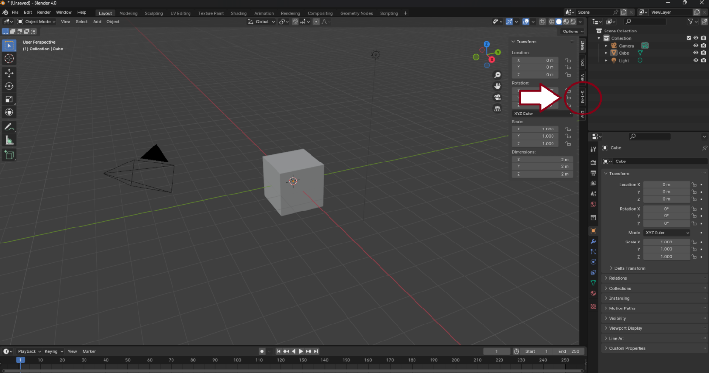

# Sketch-to-Mesh 

## Introduction:
This application's purpose is to convert a sketch or drawing into a mesh that can be imported into Blender. The application will take a set of images in .png extensions and run those images through a machine-learning model to output a usable mesh. This mesh will then be exported so that the user can do what they want with the file, such as copying and sharing the file or personally using it.

## Technologies:
  - bcrypt
  - OpenCV
  - Pytorch Vision (Depth Estimation)
  - Tensorflow Keras (CNN model object prediction)
  - bpy (Blender Python Library)
  - pymongo

## Features: 
Sketch-To-Mesh takes in multiple images and then outputs a mesh based on those images. The addon also has a database feature that allows users to save images and mesh objects to be accessed at a later date.

## AI Model:
The core of Sketch-to-Mesh lies in its advanced AI model, which leverages deep learning techniques to accurately convert 2D sketches into 3D meshes. Here’s a brief overview of how the model works:
  - **Convolutional Neural Network (CNN)**: The application uses a CNN to analyze the input images and predict the 3D structure of the objects. The CNN has been trained on a large dataset of 2D sketches and their corresponding 3D models to learn the mapping between these two domains.
  - **Depth Estimation:** Pytorch Vision is employed for depth estimation, providing an additional dimension to the 2D sketches and aiding in the accurate reconstruction of 3D shapes.
  - **Model Training:** The model was trained using TensorFlow and Keras, incorporating various techniques to enhance its accuracy and robustness. Training involved using a diverse dataset with multiple variations of 3D geometric objects to ensure the model can generalize well to different types of sketches
  - **Data Augmentation:** To improve the model's performance, extensive data augmentation techniques were applied to the training dataset, including transformations like rotation, scaling, and color adjustments.
  - **Evaluation:** The model achieved a high accuracy rate of 96%, making it reliable for generating precise 3D meshes from 2D sketches.

### stm-model training, prediction, and dataset generator documentation can be found here: <https://github.com/rfernandesdasilva/stm-model> 

## Dataset Generator:
To train our model effectively, we developed a custom dataset generator using Blender and Python scripts. Here’s an overview of the dataset generation process:
  - **Blender API (Bpy):** Utilized to create and manipulate 3D objects within Blender.
  - **Python Scripting:** Scripts were written to automate the generation of 3D objects and their corresponding 2D sketches.
  - **Variations:** The dataset includes:
    - Objects with no background.
    - Black outlines of the mesh on a white background.
    - Colored objects with black outlines and no background.
  - **Class Balancing:** Ensured the dataset was balanced across different object classes to improve model performance.

# Example dataset used for model training can be found here: <https://www.kaggle.com/datasets/breadzin/3d-geometric-objects-in-2d-plane-sketch-like>

## Installation:
- First, the user must have Blender Installed.
- Once Blender is installed the user must download the Sketch-to-Mesh file and save it in a place they can find again
- Open Blender navigation to the Edit tab and then navigate to the Preferences button at the bottom
- Once the preference tab is open navigate to the Add-On tab
- Once in the add-On tab click the install button select the Sketch-To-Mesh Folder and press Install Add-on
- You should now see the Generic Sketch-To-Mesh add-on selected in the tab. 
- You may need to refresh the addons or restart Blender

## Development Setup:
  If you would like to further develop the sketch-to-mesh addon you first would need a good idea of how the Python language works. 
  First, you might want to make a new file for your new feature. To use this feature use this "from 'YourFeature' import 'YourClass'" 
  Next, you might want to use one of the operators already made and copy it to your file. Make your changes to the operator.
  Finally, put your operator into the register and unregister

## Required Add-ons:
  StM requires a couple of different addons to be utilized. In Blender, click on Edit->Preferences->Addons and please add any missing addons.

## Usage:
  To access the plugin inside Blender, first you need to find the sidebar tab and select the STM plugin. 
  For further information, please refer to our documentation [PLACEHOLDER].

   
  
  
  

## Contributors:
  - Judah Smith-Dyer: Team leader, Full-stack
  - Rafael Fernandes Da Silva: Team Manager, Artificial Intelligence and Database Developer
  - James Burns: Mesh Algorithm Developer
  - Kliment Behr: Embedded Tool Developer

## Project Status:
  Alpha

## License: 
MIT License
  Copyright (c) [2024] [Sketch-To-Mesh]
  
  Permission is hereby granted, free of charge, to any person obtaining a copy
  of this software and associated documentation files (the "Software"), to deal
  in the Software without restriction, including without limitation the rights
  to use, copy, modify, merge, publish, distribute, sublicense, and/or sell
  copies of the Software, and to permit persons to whom the Software is
  furnished to do so, subject to the following conditions:
  
  The above copyright notice and this permission notice shall be included in all
  copies or substantial portions of the Software.
  
  THE SOFTWARE IS PROVIDED "AS IS", WITHOUT WARRANTY OF ANY KIND, EXPRESS OR
  IMPLIED, INCLUDING BUT NOT LIMITED TO THE WARRANTIES OF MERCHANTABILITY,
  FITNESS FOR A PARTICULAR PURPOSE AND NONINFRINGEMENT. IN NO EVENT SHALL THE
  AUTHORS OR COPYRIGHT HOLDERS BE LIABLE FOR ANY CLAIM, DAMAGES OR OTHER
  LIABILITY, WHETHER IN AN ACTION OF CONTRACT, TORT OR OTHERWISE, ARISING FROM,
  OUT OF OR IN CONNECTION WITH THE SOFTWARE OR THE USE OR OTHER DEALINGS IN THE
  SOFTWARE.

